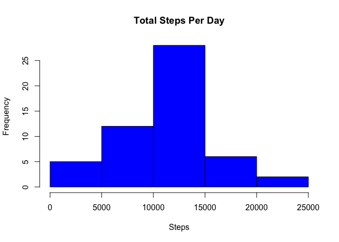
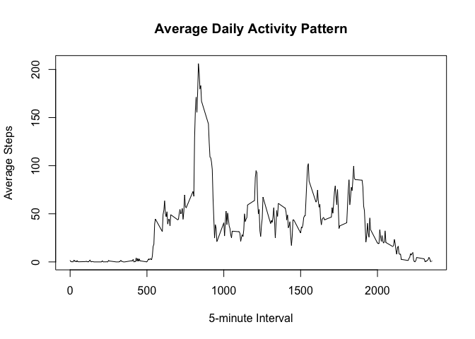
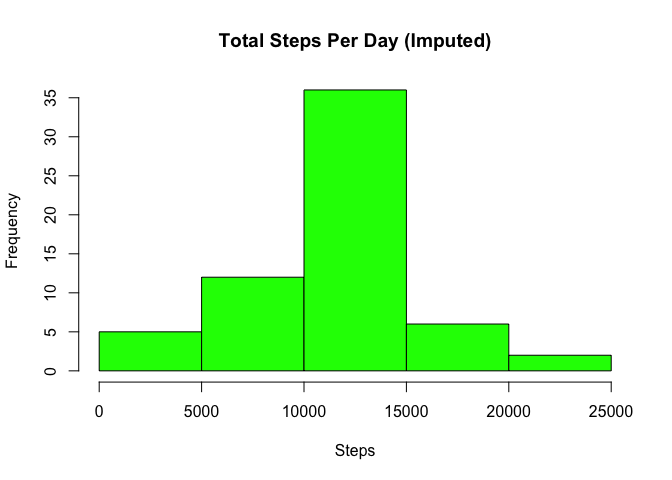
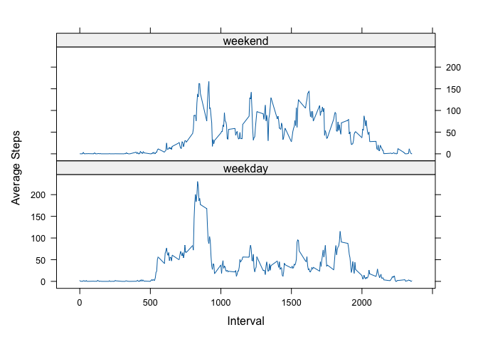

## Loading and preprocessing the data


``` r
# Load data
data <- read.csv("activity.csv")

# Convert date column to Date format
data$date <- as.Date(data$date)

# Check structure
str(data)
```

```
## 'data.frame':	17568 obs. of  3 variables:
##  $ steps   : int  NA NA NA NA NA NA NA NA NA NA ...
##  $ date    : Date, format: "2012-10-01" "2012-10-01" ...
##  $ interval: int  0 5 10 15 20 25 30 35 40 45 ...
```


## What is mean total number of steps taken per day?


``` r
# Total steps per day (ignore NA)
steps_per_day <- aggregate(steps ~ date, data, sum, na.rm=TRUE)

# Histogram
hist(steps_per_day$steps,
     main="Total Steps Per Day",
     xlab="Steps",
     col="blue")
```

<!-- -->


``` r
# Mean and median
mean_steps <- mean(steps_per_day$steps)
median_steps <- median(steps_per_day$steps)

mean_steps
```

```
## [1] 10766.19
```

``` r
median_steps
```

```
## [1] 10765
```


## What is the average daily activity pattern?


``` r
# Average steps per interval
avg_steps_interval <- aggregate(steps ~ interval, data, mean, na.rm=TRUE)

# Time series plot
plot(avg_steps_interval$interval,
     avg_steps_interval$steps,
     type="l",
     xlab="5-minute Interval",
     ylab="Average Steps",
     main="Average Daily Activity Pattern")
```

<!-- -->


``` r
# Interval with max steps
max_interval <- avg_steps_interval[which.max(avg_steps_interval$steps), ]

max_interval
```

```
##     interval    steps
## 104      835 206.1698
```


## Imputing missing values


``` r
# Count missing values
total_NA <- sum(is.na(data$steps))
total_NA
```

```
## [1] 2304
```


``` r
# Create dataset copy
data_filled <- data

# Replace NA with interval mean
for(i in 1:nrow(data_filled)) {
  if(is.na(data_filled$steps[i])) {
    interval_mean <- avg_steps_interval$steps[
      avg_steps_interval$interval == data_filled$interval[i]
    ]
    data_filled$steps[i] <- interval_mean
  }
}
```


``` r
# Total steps per day (new data)
steps_per_day_filled <- aggregate(steps ~ date, data_filled, sum)

# Histogram
hist(steps_per_day_filled$steps,
     main="Total Steps Per Day (Imputed)",
     xlab="Steps",
     col="green")
```

<!-- -->


``` r
# Mean and median after imputation
mean_filled <- mean(steps_per_day_filled$steps)
median_filled <- median(steps_per_day_filled$steps)

mean_filled
```

```
## [1] 10766.19
```

``` r
median_filled
```

```
## [1] 10766.19
```


## Are there differences in activity patterns between weekdays and weekends?


``` r
# Create weekday/weekend variable
data_filled$day_type <- ifelse(weekdays(data_filled$date) %in% c("Saturday", "Sunday"),
                              "weekend", "weekday")

data_filled$day_type <- as.factor(data_filled$day_type)
```


``` r
# Average steps by interval and day type
avg_steps_daytype <- aggregate(steps ~ interval + day_type, data_filled, mean)

library(lattice)

# Panel plot
xyplot(steps ~ interval | day_type,
       data=avg_steps_daytype,
       type="l",
       layout=c(1,2),
       xlab="Interval",
       ylab="Average Steps")
```

<!-- -->
